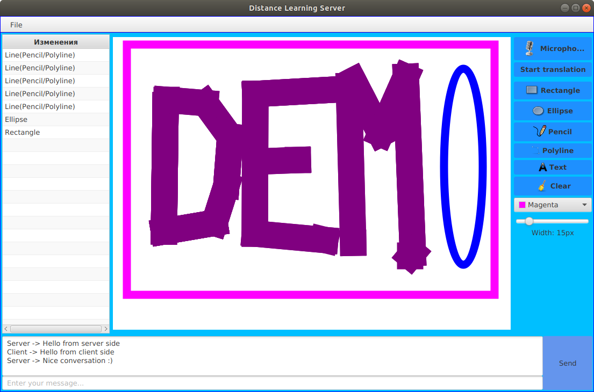
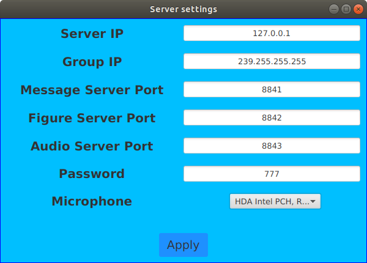
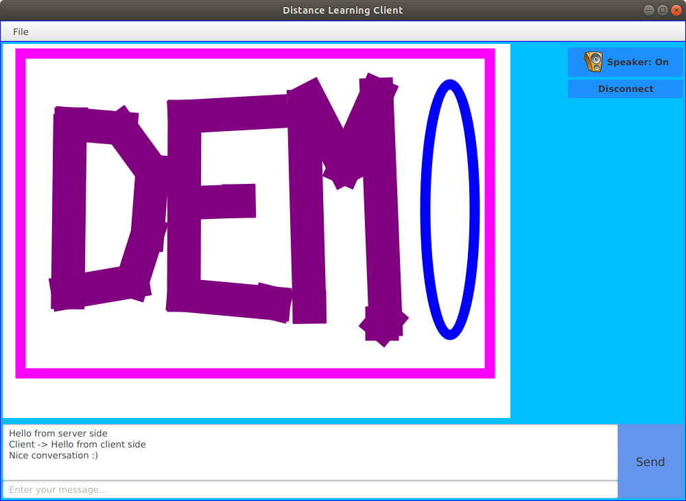
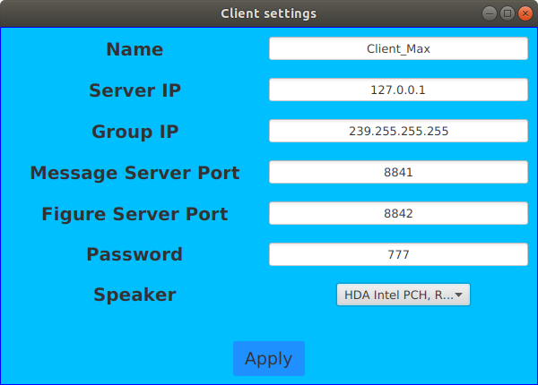

# Distance learning

Client-server application which allows to transfer audio, drawing, messages from server node to client ones and messages from client to all other nodes. The main use case is distance ~learning~ teaching.

## Run

- Use `make` commands to start server (`make run_server`) and client (`make run_client`) applications.

## Demo

### Server

1. Server main window

2. Server settings window

### Client

1. Client main window

2. Client settings window
